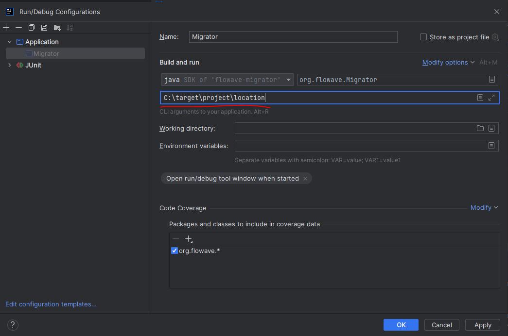

# Flowave-migrator

## Table of Contents
- [Overview](#overview)
- [Implementation](#implementation)
- [Execution](#execution)
    - [Method 1: Using as a Project](#method-1-using-as-a-project)
    - [Method 2: Using the JAR File](#method-2-using-the-jar-file)
- [Extending the Migrator](#extending-the-migrator)

## Overview
The Flowave-migrator is a tool designed to automate the migration from Camunda to Flowave.

### What is Flowave Migration?
Flowave Migration is the process of converting a Camunda-based workflow application to use the Flowave framework.

**What the migration DOES include:**

- Renaming packages from org.camunda.* to org.flowave.*
- Updating import statements across all Java files
- Converting BPMN file extensions to be compatible with Flowave
- Updating Maven dependencies to replace Camunda dependencies with Flowave equivalents
- Modifying configuration files to use Flowave-specific settings

**What the migration does NOT include:**

- Changing your business logic or variable names
- Changing the functional behavior of your workflows

## Implementation
The Flowave-migrator uses [OpenRewrite](https://docs.openrewrite.org/), a refactoring tool that applies recipes to transform source code.

### Migration Recipe
The core of the migration is defined in the [rewrite.yml](src/main/resources/rewrite.yml) file, which contains the recipe for transforming Camunda code to Flowave. The recipe includes:

- Package renaming patterns
- Import statement transformations
- Maven dependency replacements
- Configuration file updates

The migrator adds this recipe to your project temporarily, executes it, and then cleans up afterward.

## Execution
- Before running the migration, ensure that your target project builds successfully `mvn clean install -DskipTests`

- Maven home path must be set in the M2_HOME environment variable.
The target project must be a valid Maven project with a pom.xml file

## Method 1: Using as a Project
1. Clone this repository
2. Build the project: `mvn clean install`
3. Run the application by passing the target project location as below
   

## Method 2: Using the JAR File
1. Download the JAR file from the artifactory
2. Run the migrator with your target project location as an argument `java -jar flowave-migrator-1.0-SNAPSHOT.jar "/path/to/your/project"`

**Important Notes:**

- The path to your project should be enclosed in quotes, especially if it contains spaces
- Use the appropriate path format for your operating system (e.g., "C:\project\location" for Windows)
- Verify that the migration was successful by checking for the log message:
`[INFO] Using active recipe(s) [camundaToFlowave]`

## Extending the Migrator
To extend the migrator with your own custom transformations:

1. Fork the repository
2. Modify the [rewrite.yml](src/main/resources/rewrite.yml) file to include your additional transformations
3. Add new recipes by following the [OpenRewrite documentation](https://docs.openrewrite.org/reference/recipes)
4. Build your custom version of the migrator

> **Note:** The pom.xml will be reformatted during migration. You can choose to ignore formatting changes when committing to git, but make sure to retain the functional changes made by OpenRewrite.After migration, always verify the changes before committing the code to your repository.
